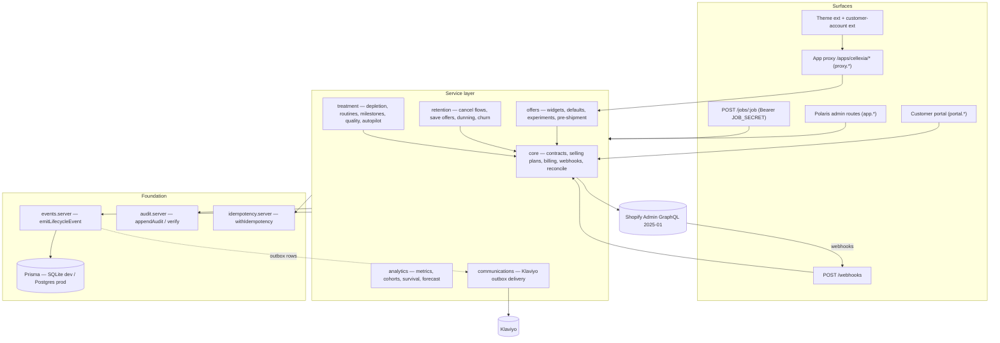

# Cellexia Continuous Treatment

A Shopify subscription app — but built as a **continuous-treatment optimisation
system**, not a billing utility. The objective function it works on is:

```
recurring AOV  ×  successful paid orders  ×  gross margin
```

across the entire subscriber lifecycle: acquisition (storefront widgets),
right-sizing (variable cadence defaults + consumption prediction), expansion
(pre-shipment add-ons, graduated routine expansion), protection (decline-aware
dunning, pre-dunning, diagnostic cancellation with a profit-aware save-offer
hierarchy), and measurement (cohorts, survival, contract-level 13-week
forecasting). Every customer-facing surface speaks the Cellexia
"Continuous Treatment" voice (see [`docs/BRAND.md`](docs/BRAND.md)): treatment
plan, routine, delivery — with the standing reassurance
*"Adjust, delay or cancel online."*

Stack: **Remix v2** (flat routes) + `@shopify/shopify-app-remix` v3 · **Prisma**
(SQLite dev / Postgres prod) · **Polaris v12** admin · theme app extension +
customer account UI extension · magic-link customer portal · Admin GraphQL
API `2025-01` · Klaviyo for all outbound communication.

> **The one Shopify semantic that shapes everything:** a subscription contract
> becomes independent of its selling plan at purchase. Editing a selling plan
> never changes existing subscribers. All subscriber changes go through the
> contract-editing draft workflow or billing-cycle mutations, and
> `SellingPlanConfig` is versioned so we always know which rules each cohort
> signed up under. See [`ARCHITECTURE.md`](ARCHITECTURE.md).

---

## Feature tour

### Storefront widgets (A / B / D / E / F)

Five widget types (`WidgetType` in [`app/types/domain.ts`](app/types/domain.ts)),
configured per shop in **Admin → Widgets** (`app.widgets.tsx`) with targeting
(products, markets, traffic sources, returning visitors) and A/B experiments:

| Widget | Type | Surface | Purpose |
| --- | --- | --- | --- |
| A | `TREATMENT_CHOICE` | PDP (theme extension) | Continuous Treatment Plan vs Basic Purchase. Treatment is the recommended, visually dominant choice; one-time stays visible but secondary. |
| B | `QUANTITY_CADENCE` | PDP (theme extension) | Quantity picker whose **default cadence varies with quantity** (buy 2 → default 8-weekly, not 4-weekly). |
| D | `ROUTINE_BUILDER` | Portal / app-proxy APIs (not the theme extension) | Assemble a multi-product routine from the compatibility graph, one contract, one delivery. |
| E | `POST_ONE_TIME` | Theme extension | Converts repeat one-time buyers into a plan at the moment the pattern is visible. |
| F | `CART_CONVERSION` | Cart (theme extension) | Converts a one-time cart line to a selling plan client-side via `POST /cart/change.js`. |

First paint costs zero API calls: widgets render selling plans straight from
Liquid (`product.selling_plan_groups`). Enhancement data — variable cadence
defaults, experiment assignment, copy overrides — arrives client-side from the
app proxy (`/apps/cellexia/api/widget-config`), and telemetry posts to
`/apps/cellexia/api/events`.

### Variable defaults + consumption prediction

`SellingPlanConfig.quantityDefaultsJson` maps quantity → default cadence in
weeks, with per-product overrides; `offers/widgets.server.ts#cadenceDefaultForQuantity`
is the single accessor. Post-purchase, the **depletion engine**
(`treatment/depletion.server.ts`) keeps a per-line `DepletionEstimate` — daily
usage, units on hand, predicted run-out date — updated by behavioural signals
(delays, skips, extra one-time purchases, survey answers, deliveries). A daily
scan emits `LIKELY_EXCESS_INVENTORY` / `LIKELY_PRODUCT_SHORTAGE` so cadence is
corrected *before* the customer experiences overflow or a gap.

### Treatment-dashboard portal

A customer portal served from the app domain (`portal.*` routes) with two
auth paths, both password-free: a **magic link** (30-minute, single-use,
hash-stored token) or a verified hand-off from the storefront/customer
accounts via the app proxy (`proxy.portal-link.tsx`, identity taken only from
the HMAC-verified `logged_in_customer_id`). Inside, the customer manages their
treatment plan: change quantity/variant, add or remove products, skip, delay,
bring forward, pause (30/60/90 days), switch cadence, change address, update
payment, add one-time items to the next delivery — every action executed
through the core contract-editing recipe and audited.

### Diagnostic cancellation flow + save-offer hierarchy + profit-aware cap

Cancellation is a diagnosis, not a door-slam (`retention/cancellation.server.ts`).
The flow asks *why* (`CancelReason` — too much product, no visible improvement,
too expensive, irritation, travelling, …) and responds with reason-specific
save offers ordered **cheapest first**: education and structural fixes (change
date, frequency, quantity, swap, remove item, pause) before any money moves
(credit, gift, temporary then permanent discount). Every session computes a
**profit-aware ceiling** (`maxSaveCostCents`) from the contract's expected
value — the engine never spends more to save a subscriber than the subscriber
is worth. Outcomes (`SAVED` / `CANCELLED` / `ABANDONED`) and offer costs are
recorded per session for reporting.

### Decline-code-specific dunning + pre-dunning

`retention/dunning.server.ts` maps raw processor decline codes to a
`DeclineCategory` (insufficient funds, expired card, authentication required,
lost/stolen, …) and picks a **category-specific retry strategy** — e.g.
insufficient funds retries around payday cadence; expired card skips useless
retries and goes straight to a payment-update email; permanent failures don't
burn retries at all. High-value contracts get gentler, longer strategies.
**Pre-dunning** warns customers of expiring cards *before* the next charge
(`CARD_EXPIRING`). Phases (`PRE_DUNNING → RETRYING → GRACE → FINAL_NOTICE →
RESOLVED | EXHAUSTED`) and the full step timeline live in `DunningState`.

### Recurring-AOV levers

- **Pre-shipment add-ons** (`offers/preShipment.server.ts`): 3–7 days before
  each billing date a window opens (`PRE_SHIPMENT_WINDOW_OPEN`) and add-on
  candidates are ranked by routine fit, purchase history, compatibility,
  margin, inventory, season and concern. Accepted items ship with the existing
  delivery (`AddOnItem`: next-only, recurring, or N deliveries).
- **Graduated routine expansion**: `ProductMeta.heroRank` + the compatibility
  graph drive a stepwise path from hero treatment to full routine
  (`treatment/routines.server.ts#recommendRoutine`), including consolidation of
  multiple contracts into one delivery (`consolidationPlan`, merge/split in core).
- **Thresholds**: quantity-tiered cadence defaults and eligibility rules
  (`ELIGIBLE_FOR_UPGRADE`, `REPEATED_ONE_TIME_ADD_ON`) turn observed behaviour
  into upgrade prompts instead of blanket discounts.

### Subscriber benefits + milestones

Benefits accumulate rather than pressure: treatment milestones
(`TREATMENT_STARTED`, `FIRST_MONTH`, `NINETY_DAYS`, `SIX_DELIVERIES`,
`ONE_YEAR`) are detected daily, recorded once per contract (`Milestone`), and
rewarded through Klaviyo flows (`TREATMENT_MILESTONE`, `SUBSCRIBER_ANNIVERSARY`).
Account credit is applied as a one-cycle discount through the contract draft
workflow — never as an off-books adjustment.

### Executive analytics + forecasting

`app._index.tsx` is the executive dashboard; `app.analytics.tsx` goes deeper:
- **Cohorts** by acquisition dimension (widget version, discount level, market…)
- **Survival curves** with cancellation separated from payment failure — two
  different diseases, two different treatments
- **13-week contract-level forecast** (`analytics/forecast.server.ts`): per
  contract, `P(success) × expected order value × expected margin`, aggregated
  weekly by SKU and market into `ForecastSnapshot` — including expected skips,
  pauses, cancellations, failed payments, add-on units, and confidence
  intervals. This is an operations tool (inventory, cash) as much as a
  reporting one.

### Proprietary engines

All decision logic is written as **pure functions** over plain inputs
(unit-tested in `tests/`), separated from Prisma/Shopify I/O:

| Engine | Module | Core export |
| --- | --- | --- |
| Depletion / run-out prediction | `treatment/depletion.server.ts` | `predictRunOutDate` |
| Subscription quality score | `treatment/quality.server.ts` | `computeQualityScore` |
| Churn prediction | `retention/churn.server.ts` | `computeChurnRisk` |
| Adherence | `treatment/*` + `AdherenceSurvey` | survey-driven depletion overrides |
| Compatibility graph | `CompatibilityEdge` + `treatment/routines.server.ts` | `recommendRoutine` |
| Profit-aware retention | `retention/cancellation.server.ts` | `getOffersForSession` (cost-capped) |
| Autopilot | `treatment/*` + contract guardrails | `guardrailsJson` (`AutopilotGuardrails`) |

Autopilot acts only inside per-contract guardrails: `maxChargeCents`,
`askBeforeAdding`, `minIntervalWeeks`, `notifyDaysBefore` — silent-but-notified
optimisation, never surprise charges.

### Klaviyo-native communications layer

The app sends **zero emails itself**. Every service emits lifecycle events via
`emitLifecycleEvent` (25 event names in `LIFECYCLE_EVENTS`), which land in the
analytics warehouse and an **outbox** (`OutboundEvent`, unique dedupe key).
`communications/klaviyo.server.ts#processOutboxJob` delivers them to Klaviyo as
`"Cellexia <Title Case>"` metrics — batched, retried with backoff, `DEAD` after
8 attempts. Klaviyo flows own the actual messaging; the outbox guarantees
at-least-once delivery with replay safety, and drains automatically after a
Klaviyo outage.

### Operational safeguards

Immutable hash-chained audit log, idempotent billing, webhook replay
protection, RBAC, versioned selling-plan rules, reconciliation job, and more —
each mapped to its implementation in
[`docs/SAFEGUARDS.md`](docs/SAFEGUARDS.md).

---

## Architecture

Six domain services sit on a small foundation (events, audit, idempotency,
money/dates/crypto) and are reached through thin surfaces. Cross-service calls
go only through the exact contracts in [`ARCHITECTURE.md`](ARCHITECTURE.md).



(The portal module — magic-link auth + session — is a surface plus a small
`services/portal/` auth service; it executes all mutations through core.)

## Getting started

Prereqs: Node ≥ 20.10, the [Shopify CLI](https://shopify.dev/docs/apps/tools/cli),
a Partner Dashboard app (see [`docs/RUNBOOK.md`](docs/RUNBOOK.md) for creation
and scopes).

```bash
npm install
cp .env.example .env        # fill in secrets — see .env.example comments
npm run config:link         # shopify app config link → writes client_id into shopify.app.toml
npm run setup               # prisma generate && prisma migrate deploy
npm run dev                 # shopify app dev — tunnel, HMR, serves app + extensions
```

Deploying extensions and app configuration (webhooks, app proxy, scopes are
all declared in `shopify.app.toml` and shipped with the version):

```bash
npm run deploy              # shopify app deploy
```

Scheduled work is exposed as an HTTP jobs registry — no in-process scheduler.
Point any scheduler (cron, Fly machines, GitHub Actions…) at it:

```bash
curl -fsS -X POST "$APP_URL/jobs/outbox" -H "Authorization: Bearer $JOB_SECRET"
```

Suggested cadences: `outbox` every 5 min · `dunning-queue` hourly ·
`pre-dunning`, `pre-shipment`, `churn-scan`, `depletion-scan`, `milestones`,
`anniversaries`, `reconcile` daily · `forecast`, `prune` weekly. Full curl
examples and crontab in [`docs/RUNBOOK.md`](docs/RUNBOOK.md).

Tests (vitest, pure decision logic):

```bash
npm test
```

## Project layout

| Path | What lives there |
| --- | --- |
| `app/shopify.server.ts`, `app/db.server.ts`, `app/root.tsx` | Foundation: Shopify app config, Prisma client, Remix shell |
| `app/types/domain.ts` | Shared const unions & types — **every enum-like DB string comes from here** |
| `app/lib/` | Money (integer cents), dates, logger, crypto (AES-256-GCM secrets, token hashing) |
| `app/services/events.server.ts` | `emitLifecycleEvent` — the only path to Klaviyo |
| `app/services/audit.server.ts` | Hash-chained append-only audit log |
| `app/services/idempotency.server.ts` | `withIdempotency` guard for money movement + contract edits |
| `app/services/core/` | Contract mirror + edits, selling plans, billing, webhooks, reconciliation, RBAC, Shopify client |
| `app/services/offers/` | Widget resolution, cadence defaults, experiments, pre-shipment ranking |
| `app/services/retention/` | Cancellation sessions, save offers, dunning, churn scoring |
| `app/services/treatment/` | Depletion, adherence, compatibility, routines, milestones, quality, autopilot |
| `app/services/analytics/` | Executive metrics, cohorts, survival, LTV, 13-week forecast |
| `app/services/communications/` | Klaviyo client + outbox delivery |
| `app/services/portal/` | Magic-link auth + portal session |
| `app/routes/app.*` | Polaris admin (dashboard, analytics, subscribers, plans, widgets, retention, dunning, treatment, settings) |
| `app/routes/webhooks.tsx` | All webhook topics, replay-guarded dispatch |
| `app/routes/jobs.$job.tsx` | Scheduled-job runner |
| `app/routes/portal.*`, `app/routes/proxy.*` | Customer portal + storefront app-proxy APIs |
| `app/graphql/` | All Admin GraphQL documents (exported constants, owned by core) |
| `extensions/treatment-widgets/` | Theme app extension — widgets A/B/E/F |
| `extensions/customer-portal-link/` | Customer account UI extension ([its README](extensions/customer-portal-link/README.md)) |
| `prisma/schema.prisma` | Data model — narrated in [`docs/DATA-MODEL.md`](docs/DATA-MODEL.md) |
| `tests/` | Vitest unit tests for pure decision logic |

## Documentation

| Doc | Contents |
| --- | --- |
| [`ARCHITECTURE.md`](ARCHITECTURE.md) | Module ownership, hard conventions, exact cross-service contracts, Shopify recipes |
| [`docs/RUNBOOK.md`](docs/RUNBOOK.md) | Operations: setup, scopes, webhooks, Postgres migration, job scheduling, monitoring, incident playbooks |
| [`docs/SAFEGUARDS.md`](docs/SAFEGUARDS.md) | Every non-negotiable safeguard mapped to its implementation |
| [`docs/DATA-MODEL.md`](docs/DATA-MODEL.md) | Narrated tour of the Prisma schema + exact JSON column shapes |
| [`docs/BRAND.md`](docs/BRAND.md) | Brand tokens, theme integration conventions, customer-facing voice |
| [`extensions/customer-portal-link/README.md`](extensions/customer-portal-link/README.md) | Customer-account extension + portal hand-off flow |

## Hard conventions (the short version)

1. Money is integer minor units (`amountCents`) + `currencyCode`; use `~/lib/money`.
2. Enum-like DB strings come from `~/types/domain` — no ad-hoc strings.
3. `*Json` columns hold `JSON.stringify` payloads; parse with `parseJson`.
4. Every state change appends `appendAudit(...)`.
5. Money movement and contract edits run inside `withIdempotency(key, scope, fn)`;
   billing keys are `bill:<contractId>:<billingCycleIndex>`.
6. Webhooks record `ProcessedWebhook` first — replays are skipped.
7. Lifecycle events only via `emitLifecycleEvent` — never call Klaviyo directly.
8. Decision logic is pure, I/O-free, and unit-tested.

See [`ARCHITECTURE.md`](ARCHITECTURE.md) for the complete list and the exact
cross-service export contracts.
